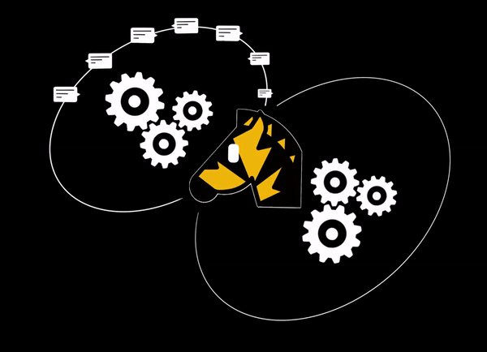

<h1 align="center">🦓&nbsp;Livestack
</h1>

A realtime first, fullstack AI orchestration framework for JavaScript developers.

## Why Livestack?

We foresee a future where AI evolves beyond just passive, command-driven chatbots. 

As proactive companions, they will be actively participating in our daily routines, anticipating and fulfilling our needs just when we need them. We expect our lives and productivity to improve by orders of magnitude in the coming years.

At present, however, to realize such AI applications is a complex task. Popular AI frameworks today aren't well-suited for realtime interaction and often require extensive coding. 

Livestack aims to democratize this process, making it approachable not just for seasoned developers but also for those with basic coding skills, and eventually, for everyone.

We look forward to seeing your next idea come to life with Livestack!

## Features

Livestack aims at providing:

- Native support for stream-based, realtime workflows.
- Built-in queue system that automatically scales your application to many machines.
- Built-in logging and visualization of all in-app activities for easy debugging and AI improvement.
- (WIP) Common realtime AI components, patterns and guidelines for rapid prototyping, such as:
  -  live speech transcription.
  -  live RAG workflow.
  -  realtime image generation.
- (WIP) Support for both LLM and image generation models.
- (WIP) Simple setup process for new AI application.

## Getting Started

## Comparison with other frameworks

## Design principles

- Reduce cognitive load for developers as much as possible.
- Reasonable defaults for quick project setup.
