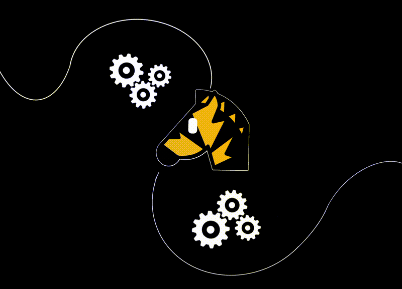

<h1 align="center">🦓&nbsp;Livestack
</h1>

A Realtime AI framework. From concept to deployment in hours.  Made with ❤ for JavaScript developers.

## Why Livestack?

We foresee a future where AI evolves beyond just passive, command-driven chatbots. 

As proactive companions, they will be actively participating in our daily routines, anticipating and fulfilling our needs just when we need them. We expect our lives and productivity to improve by orders of magnitude in the coming years.

At present, however, to realize such AI applications is a complex task. Popular AI frameworks today aren't well-suited for realtime interaction and often require extensive program design and coding. Once prototyped, there are still many steps to take to scale and deploy the application.

Livestack aims to democratize this process, making it approachable not just for seasoned developers but also for those with basic coding skills, and eventually, for everyone.

We look forward to seeing your next idea come to life with Livestack!

## Features

Livestack aims at providing:

- Native support for stream-based, realtime orchestrations.
- Fullstack templates for both frontend and backend.
- Built-in queue system that automatically scales your AI project to many machines.
- Built-in data persistence of all in-app activities for easy debugging and future model tuning.
- Graph-based workflows for better reasoning, visual inspection and debugging.
- (WIP) Common realtime AI components, patterns and guidelines for rapid prototyping, including:
  -  live speech transcription.
  -  live RAG workflow.
  -  realtime image generation.
- (WIP) Simple bootstrap process for new AI project.

## Quickstart

WIP

## Comparison with other frameworks

See [here](_misc/docs/comparison.md).

## Design Principles

- Reduce cognitive load for developers. 
- Reasonable defaults for quick project bootstrapping.
- Minimal surprises.