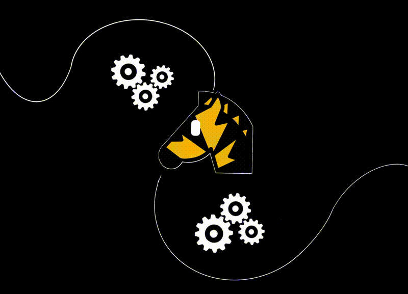

<h1 align="center">Livestack&nbsp;🦓
</h1>

<p align="center">

<a href="https://www.npmjs.com/@livestack/core"></a>
</p>

<p align="center">A full stack, realtime AI framework for JavaScript developers. <br />From concept to deployment in hours. </p>

<p align="center">

</p>

## Why Livestack?

We believe the future of AI is not just about passive chatbots. It's about realtime AI applications that are always on, always listening, always ready to help.

At present, however, to implement such an AI project is still a complex task. Existing AI frameworks aren't well-suited for realtime interaction and often require extensive program design and coding. Once it's prototyped, there are still many steps to take to scale and deploy the application before it can be used by others.

Livestack, designed from the ground up, aims to democratize this process, making it approachable not just for seasoned developers but also for those with basic coding experience, and eventually, for everyone.

We look forward to seeing your next idea come to life with Livestack!


## Quickstart

- [Build Your Own Real Time Conversation Assistant: Transcription, Summarization, and Translation](https://live.dev/docs/documents/_livestack_tutorials.1_speech_app_tutorial.html)
- Learn the mechanics (single JobSpec): [Minimal Example: Live Counter](https://live.dev/docs/documents/_livestack_tutorials.2_live_counter_tutorial.html)
- Learn the mechanics: Minimal Example: Liveflow Zoo

## Installation
  
```bash
# Install both backend and frontend packages
npm install @livestack/core @livestack/gateway @livestack/client
```

For a detailed walkthrough, choose one of the tutorials from the quickstart section above. The tutorials are also available locally in the `tutorials/` directory.


## Join the Community
[](https://discord.gg/JGnGCFgWkN)

## Features (current)

Livestack aims at providing:

- Stream & liveflow based architecture.
- Tools and patterns for realtime orchestration.
- Simple, hassle-free bootstrap & deployment process for new AI project.
- Graph-based liveflows for better reasoning, visual inspection and debugging:
  - Support for multiple input & output streams for every processing node 
  - Visualization for easy inspection and debugging (via the local, publishable `@livestack/viz` package, still a work in progress).
- Built-in data persistence & validation of all in-app activities for easy inspection and model training.
- Provisioning system that automatically scales your AI project to many machines with zero configuration.
- Support for hybrid local and cloud deployment.
- Live speech transcription (via `@livestack/transcribe`, Whisper-based).

## Features (planned)
- (WIP) full-stack realtime AI components, patterns and guidelines for rapid prototyping, including:
  - live RAG liveflow.
  - [Game development](https://github.com/zigzag-tech/ready-agent-one)
  -  realtime image generation.


## Comparison with other frameworks


| Features                                                    | Livestack | Langchain/<br />LangGraph | Llamaindex | ComfyUI | Ray.io |
| ----------------------------------------------------------- | :-------: | :-----------------------: | :--------: | :-----: | ------ |
| Liveflow  (realtime workflow)                               |    ✅     |            ❌             |     ❌     |   ❌    | ❌     |
| Full-stack app scaffolding                                  |    ✅     |            ❌             |     ❌     |   ❌    | ❌     |
| Job autoscaling                                             |    ✅     |            ❌             |     ❌     |   ❌    | ❌     |
| Any modality as input/output <br />(e.g. text/image/audio)  |    ✅     |            ❌             |     ❌     |   ❌    | ✅     |
| Allow any number of input/output <br />per processing node  |    ✅     |            ❌             |     ❌     |   ✅    | ✅     |
| Streaming & async input/output                              |    ✅     |            🔶            |    🔶     |   ❌    | 🔶    |
| Long running stream processing                              |    ✅     |            ❌             |     ❌     |   ❌    | ✅     |
| Cloud+on-prem mixed deployment <br />(local + cloud hybrid) |    ✅     |            ❌             |     ❌     |   ❌    | 🔶    |
| Out-of-the-box data logging                                 |    ✅     |            ❌             |     ❌     |   ❌    | ❌     |
| Python + JS Hybrid language liveflows                       |    🚧    |            ✅             |     ❌     |   ❌    | ❌     |
| Official support audio Input & output                       | ✅ input<br />🚧 output |            ❌             |     ❌     |   ❌    | ❌     |
| Official support for Image as output                        |    🚧    |            ❌             |     ❌     |   ✅    | ❌     |

Legend:
- ✅: Fully supported
- 🔶: Partially supported
- ❌: Not supported
- 🚧: Work in progress

## Design Principles

- Simplicity triumphs over complexity: reduce user's cognitive load as much as possible.
- Reasonable defaults to reduce burden of configuration.
- Minimal surprises and gotchas.
- Introduce new concepts and abstractions only when absolutely necessary.
- Battle-test a new feature, hurt it plenty, before releasing it.
