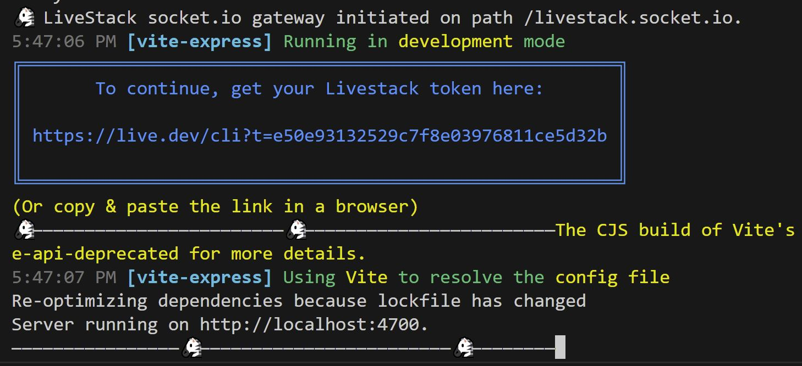
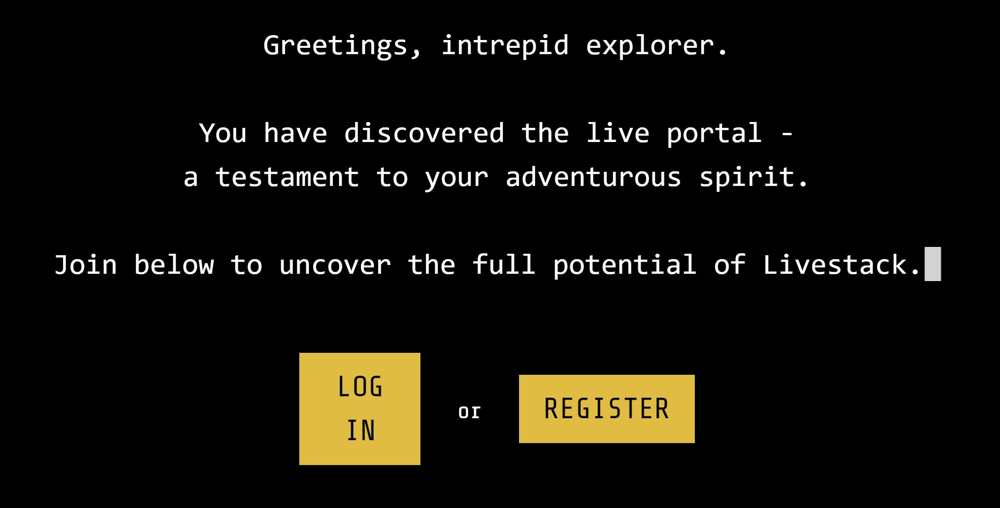
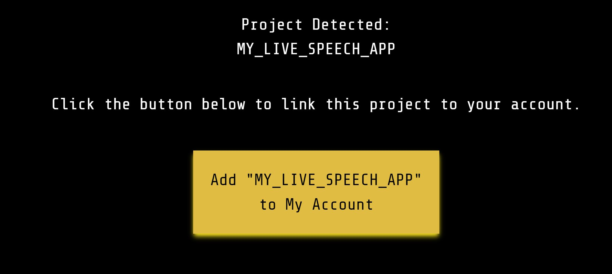
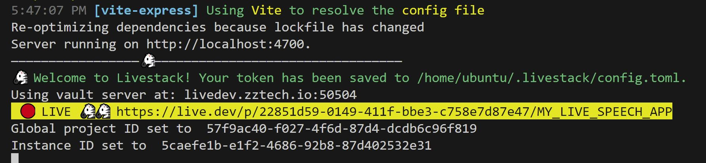
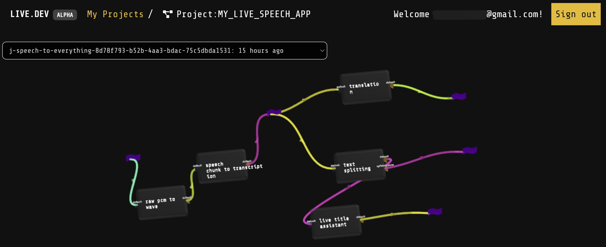

# Build Your Own Real Time Conversation Assistant: Transcription, Summarization, and Translation

In this tutorial, you'll learn how to build a real-time speech app using the Livestack framework. This app will record speech, transcribe it into text, translate the text into French, and provide a summarized title periodically.

## Prerequisites

Before you begin, make sure you have the following installed:

- Node.js (20.0.0 or higher)
- An OpenAI API key (Get one [here](https://platform.openai.com/signup))


## Jump Start the Example App

If you want to get started quickly without going through each step in detail, you can use the Livestack example project creator. This will set up all the necessary files for you.

1. **Create a new Livestack app:**

```bash
npx create-livestack my-livestack-app --template typescript-speech-app
```

2. **Navigate to your project directory and install dependencies:**

```bash
cd my-livestack-app
npm install
```

3. **Start the app server:**

```bash
npm run dev
```

This will set up and run the app immediately. However, if you want to understand how everything works, we recommend going through the detailed approach below.

4. **If you are running a Livestack app for the very first time:**

If you're running a Livestack app for the very first time, you will need to complete the sign-up or login process. Here are the steps to guide you through this process:

- After running `npm run dev`, you should see below in your terminal. Click on the link `https://live.dev/cli?t=xxxx` after `To continue, get your Livestack token here`:
&nbsp;


&nbsp;

- The link will take you to a browser window where you can either LOG IN or REGISTER:
&nbsp;


&nbsp;

- After logging in, you should be redirected to the page below where you can click on the yellow button that says `Add xxx to My Account`:
&nbsp;


&nbsp;


- Congratulations! You've successfully linked your project to your account, and your terminal should print out a line saying `Welcome to Livestack! Your token has been saved to `xxx/.livestack/config.toml`:
&nbsp;


&nbsp;

- You might have noticed the highlighted line that says `LIVE https://live.dev/p/xxxx` in the above screenshot. If you click on the link, you will be taken to the project dashboard where you can monitor your workflow linage and data flow in real-time:
&nbsp;


&nbsp;

By following these steps, you will successfully complete the sign-up or login process and be ready to use the Livestack app.

## Create the Example App from Scratch

If you prefer to understand each step in detail, follow the instructions below to create the example app from scratch.

### Step 1: Setting Up the Project

First, we need to create a new React project and install the necessary dependencies.

1. **Create a new React app:**

The command below will help you create a project scaffold.

```bash
npx create-livestack my-livestack-app
cd my-livestack-app
```

2. **Install required dependencies:**

```bash
npm install
```

### Step 2: Client-Side Implementation

We'll start by setting up the client side of our application.

#### 2.1 Define Shared Constants

Create a file for shared constants.

**`src/common/defs.ts`**:

```ts
export const SPEECH_LIVEFLOW_NAME = "<your_speech_liveflow_name>";
```

#### 2.2 Create `SpeechComponents.tsx`

This component will handle the recording and display of transcriptions.

**`src/client/SpeechComponents.tsx`**:

```tsx
"use client";
import React from "react";
import {
  usePCMRecorder,
  encodeToB64,
  rawPCMInput,
  speechChunkToTextOutput,
} from "@livestack/transcribe/client";
import { useJobBinding, useOutput, useInput } from "@livestack/client";
import { SPEECH_LIVEFLOW_NAME } from "./common/defs";
import { translationOutputSchema } from "@livestack/lab-internal-common";
import { FaStop, FaMicrophone } from "react-icons/fa";
import { z } from "zod";
import prettyBytes from "pretty-bytes";

export const SpeechComponents: React.FC = () => {
  const job = useJobBinding({
    specName: SPEECH_LIVEFLOW_NAME,
  });

  const { feed } = useInput({
    tag: "input-default",
    def: rawPCMInput,
    job,
  });

  const translation = useOutput({
    tag: "translation",
    def: translationOutputSchema,
    job,
    query: { type: "lastN", n: 10 },
  });

  const { last: summarizedTitle } = useOutput({
    tag: "summarized-title",
    def: z.object({
      summarizedTitle: z.string(),
    }),
    job,
  });

  const transcription = useOutput({
    tag: "transcription",
    def: speechChunkToTextOutput,
    job,
    query: { type: "lastN", n: 10 },
  });

  const [volume, setVolume] = React.useState<number>(0);

  const { startRecording, stopRecording, isRecording, cumulativeDataSent } =
    usePCMRecorder({
      onDataAvailable: async (data) => {
        const encoded = encodeToB64(data);
        if (feed) {
          await feed({ rawPCM64Str: encoded });
          console.log(encoded.slice(0, 10), "length: ", encoded.length);
        }
      },
      onVolumeChange: (volume) => {
        setVolume(volume);
      },
    });

  const handleRecording = isRecording ? stopRecording : startRecording;

  return (
    <div className="m-4 grid grid-cols-5 gap-2 divide-x">
      <div>
        <h2 className="text-red-800">1. Click on "Start Recording" button</h2>
        <br />
        {job.jobId && (
          <button
            className="btn w-fit rounded border border-gray-800 bg-gray-200 p-2"
            onClick={handleRecording}
          >
            <span style={{ display: "inline-block" }}>
              {isRecording ? "Stop Recording" : "Start Recording"}
            </span>
            &nbsp;
            <span style={{ display: "inline-block" }}>
              {isRecording ? <FaStop /> : <FaMicrophone />}
            </span>
          </button>
        )}
        <div>
          Volume: <span>{volume.toFixed(1)}</span>
          <br />
          <progress
            value={volume}
            max={100}
            style={{ width: "100px" }}
          ></progress>
          <br />
          {typeof cumulativeDataSent !== "undefined" && (
            <>Total data sent: {prettyBytes(cumulativeDataSent)}</>
          )}
        </div>
      </div>
      <div className="col-span-2">
        <div className="ml-4">
          <h2 className="text-green-800">
            2. Speech transcripts will pop up here
          </h2>
          <br />
          <article style={{ maxWidth: "100%" }}>
            {transcription.map((transcript, i) => (
              <span key={i} className="text-sm">
                {transcript.data.transcript}
              </span>
            ))}
          </article>
        </div>
      </div>
      <div className="col-span-2">
        <div className="ml-4">
          <h2 className="text-blue-800">
            3. Periodically, a one-liner short summary is generated
          </h2>
          <br />
          <p>{summarizedTitle?.data.summarizedTitle}</p>
          <br />
          {translation && (
            <div>
              <h2 className="text-indigo-800">
                4. Your speech translated to French
              </h2>
              <br />
              {translation.map((t, idx) => (
                <div key={idx}>{t.data.translated}</div>
              ))}
            </div>
          )}
        </div>
      </div>
    </div>
  );
};

export default SpeechComponents;
```

#### 2.3 Create `index.tsx`

Create the main entry point for the React application.

**`src/client/index.tsx`**:

```tsx
import React, { Suspense } from "react";
import ReactDOM from "react-dom/client";
import SpeechComponents from "./SpeechComponents";
import "./globals.css";

const root = ReactDOM.createRoot(
  document.getElementById("root") as HTMLElement
);

root.render(
  <Suspense fallback={<div>Loading...</div>}>
    <SpeechComponents />
  </Suspense>
);
```

### Step 3: Server-Side Implementation

Next, we will set up the server that will handle the speech processing.

#### 3.1 Define the Speech LiveFlow

Define the workflow for processing speech input in `liveflow.speech.ts`.

**`src/server/liveflow.speech.ts`**:

```ts
import {
  rawPCMToWavSpec,
  speechChunkToTextSpec,
} from "@livestack/transcribe/server";
import { Liveflow, conn, expose } from "@livestack/core";
import { SPEECH_LIVEFLOW_NAME } from "../common/defs";
import { translationSpec } from "@livestack/translate-server";
import { titleSummarizerSepc } from "@livestack/summarizer/server";
import { textSplittingSpec } from "@livestack/lab-internal-server";

export const speechLiveflow = Liveflow.define({
  name: SPEECH_LIVEFLOW_NAME,
  connections: [
    conn({
      from: rawPCMToWavSpec,
      transform: ({ wavb64Str }) => ({ wavb64Str, whisperType: "openai" }),
      to: speechChunkToTextSpec,
    }),
    conn({
      from: speechChunkToTextSpec,
      transform: ({ transcript }) => transcript,
      to: textSplittingSpec,
    }),
    conn({
      from: textSplittingSpec,
      transform: (chunkText) => ({ transcript: chunkText, llmType: "openai" }),
      to: titleSummarizerSepc,
    }),
    conn({
      from: speechChunkToTextSpec,
      transform: ({ transcript }) => ({
        toLang: "French",
        text: transcript,
        llmType: "openai",
      }),
      to: translationSpec,
    }),
  ],
  exposures: [
    expose(rawPCMToWavSpec.input.default, "input-default"),
    expose(speechChunkToTextSpec.output.default, "transcription"),
    expose(titleSummarizerSepc.output.default, "summarized-title"),
    expose(translationSpec.output.default, "translation"),
  ],
});
```

#### 3.2 Create `index.ts`

Set up the main server file to initialize the environment and start the server.

**`src/server/index.ts`**:

```ts
import { LiveEnv } from "@livestack/core";
import { getLocalTempFileStorageProvider } from "@livestack/core";
import { initJobBinding } from "@livestack/gateway";
import express from "express";
import path from "path";
import bodyParser from "body-parser";
import cors from "cors";
import ViteExpress from "vite-express";
import { speechLiveflow } from "./liveflow.speech";

const liveEnvP = LiveEnv.create({
  projectId: "MY_LIVE_SPEECH_APP",
  storageProvider: getLocalTempFileStorageProvider("/tmp/zzlive"),
});

async function main() {
  LiveEnv.setGlobal(liveEnvP);

  const app = express();
  app.use(cors());
  app.use(bodyParser.json());
  app.use(express.static(path.join(__dirname, "..", "public")));

  const PORT = 4700;

  const httpServer = ViteExpress.listen(app, PORT, () => {
    console.info(`Server running on http://localhost:${PORT}.`);
  });

  initJobBinding({
    httpServer,
    allowedSpecsForBinding: [speechLiveflow],
  });
}

main();
```

### Project Structure

Ensure your project structure matches this:

```
my-livestack-app/
├── node_modules/
├── public/ (optional)
├── src/
│   ├── client/
│   │   ├── index.tsx
│   │   ├── SpeechComponents.tsx
│   │   └── globals.css
│   ├── server/
│   │   ├── index.ts
│   │   └── liveflow.speech.ts
│   └── common/
│       └── defs.ts
├── package.json
├── tsconfig.json
├── index.html
├── postcss.config.cjs
├── tailwind.config.ts
├── vite.config.ts
├── .gitignore
└── .env (optional)
```

### Running the App

```bash
npm run dev
```

### Conclusion

By following this tutorial, you've built a real-time speech transcription, translation and summary app using the Livestack framework. The app records speech, transcribes it, translates it into French, and periodically generates a summarized title. For a quick start, use the `npx create-livestack <project-directory> --template [typescript-speech-app / typescript-backend-only / typescript-setup-only]` command, or follow the detailed steps to gain a deeper understanding of the process.
